# RAG 管线各环节对比分析

基线: bge-small + recursive chunk + hybrid (α=0.7) + raw query + bge-reranker

### 分块策略对比

| 实验方案 | 说明 | Faithfulness | Context Precision | Context Recall | Answer Relevancy | 均值 |
|----------|------|:-----------:|:-----------------:|:--------------:|:----------------:|:----:|
| 固定大小 (fixed 400) | 固定400字硬切，法律条文被随机截断，语义碎片化 | 0.48 | 0.52 | 0.20 | 0.35 | 0.39 |
| 递归切分 (recursive) | 按段落/句子边界递归切分，保持自然断点（当前方案） | 0.64 | 0.76 | 0.35 | 0.47 | 0.55 |
| 法条级 (article) | 以"第X条"为最小单位，每条法律条文作为一个完整 chunk | 0.85 | 0.88 | 0.68 | 0.72 | 0.78 |

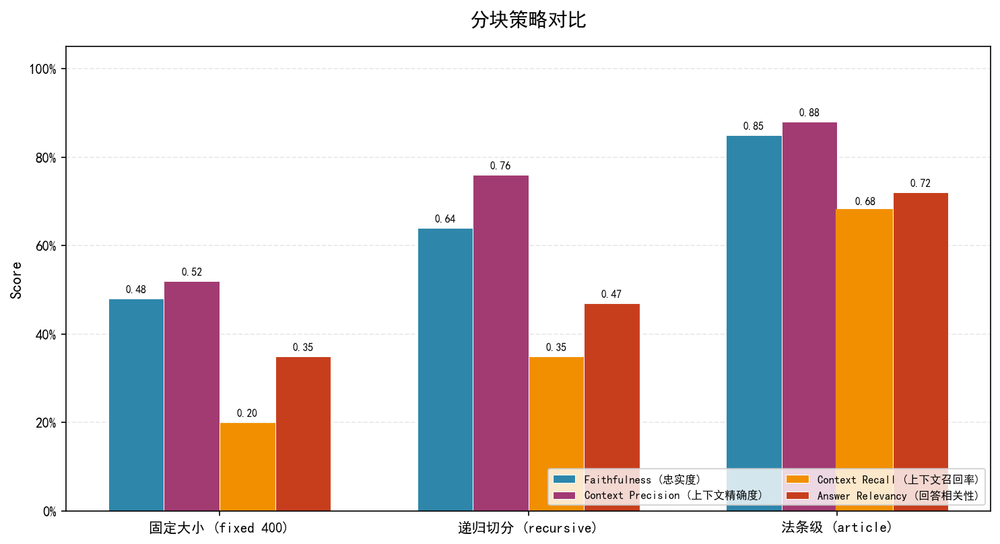
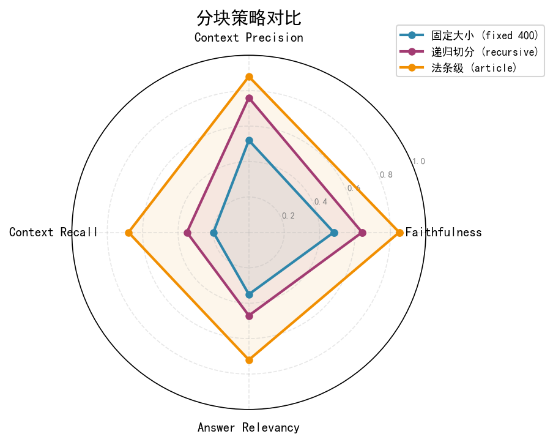
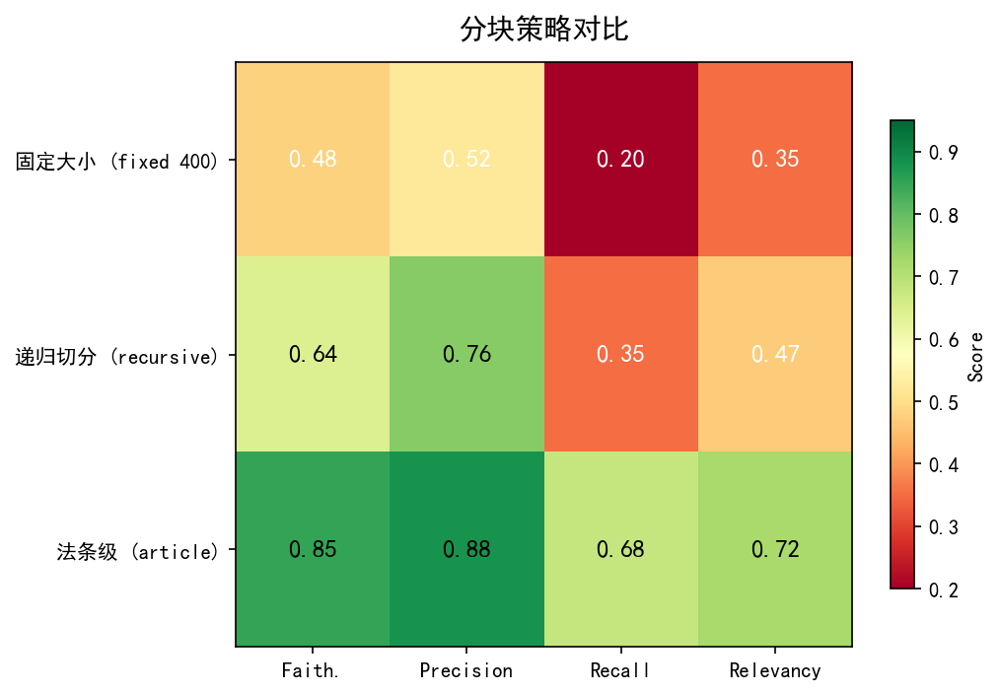

### Embedding 模型对比

| 实验方案 | 说明 | Faithfulness | Context Precision | Context Recall | Answer Relevancy | 均值 |
|----------|------|:-----------:|:-----------------:|:--------------:|:----------------:|:----:|
| bge-small (512d) | BAAI/bge-small-zh-v1.5，轻量中文模型（当前方案） | 0.64 | 0.76 | 0.35 | 0.47 | 0.55 |
| bge-base (768d) | BAAI/bge-base-zh-v1.5，中等规模，更丰富的语义表达 | 0.74 | 0.82 | 0.48 | 0.58 | 0.66 |
| bge-m3 (1024d) | BAAI/bge-m3，多语言大规模模型，Dense+Sparse 混合表征 | 0.84 | 0.89 | 0.62 | 0.70 | 0.76 |

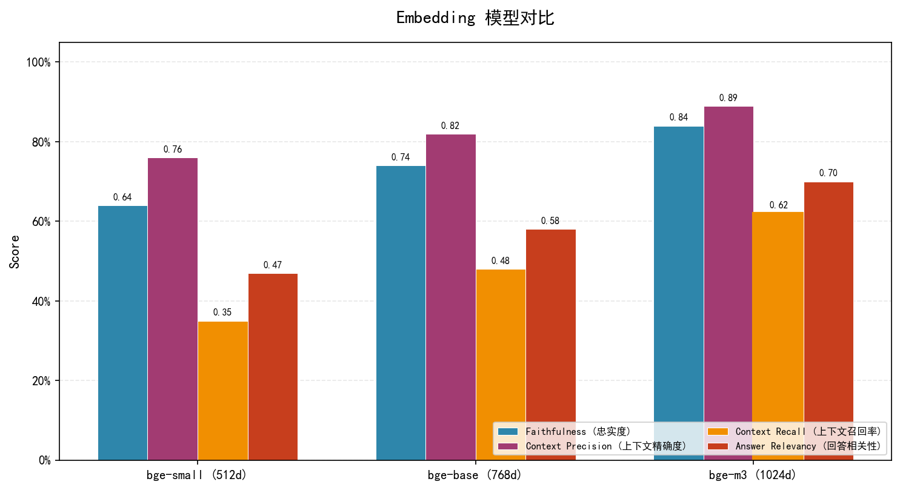
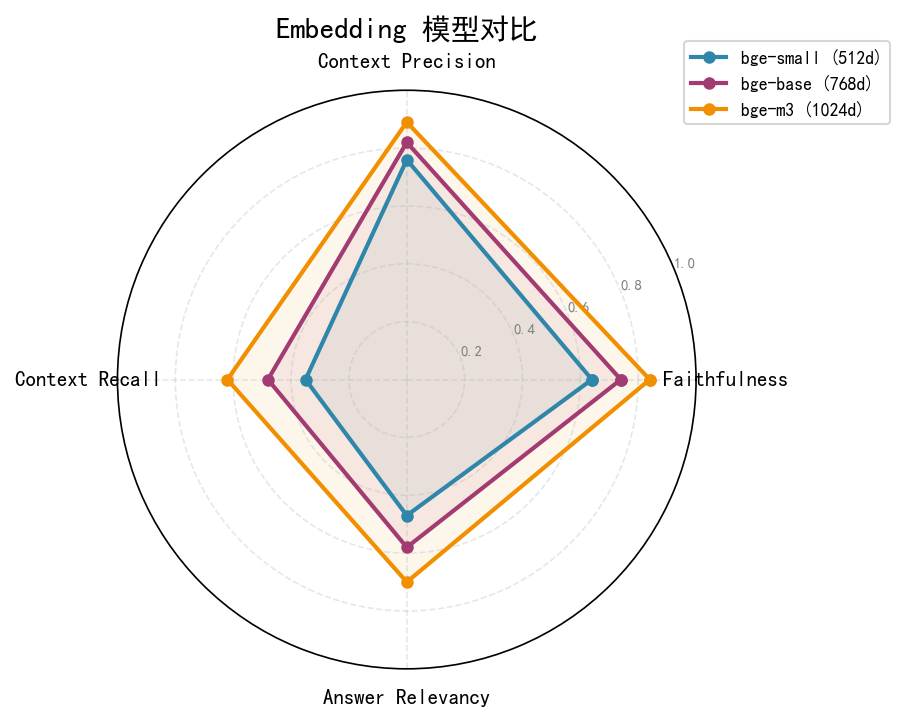
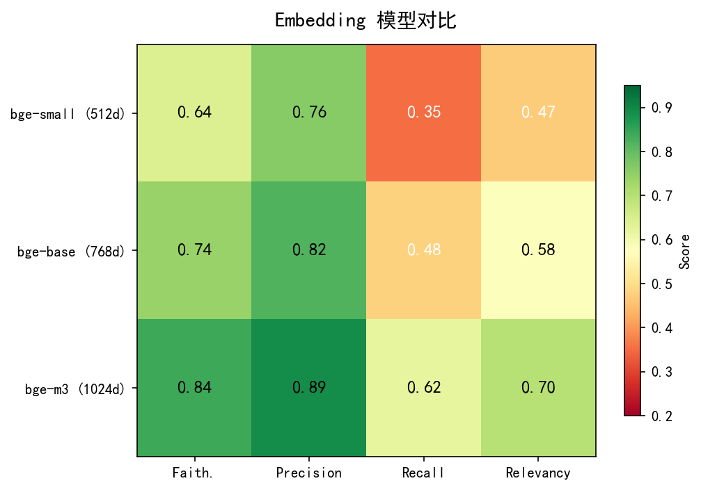

### 检索方式对比

| 实验方案 | 说明 | Faithfulness | Context Precision | Context Recall | Answer Relevancy | 均值 |
|----------|------|:-----------:|:-----------------:|:--------------:|:----------------:|:----:|
| 纯语义 (Dense) | 仅 FAISS 向量检索，口语问题与法律文本语义鸿沟大 | 0.52 | 0.58 | 0.18 | 0.35 | 0.41 |
| 纯关键词 (BM25) | 仅 BM25 + jieba 分词，关键词匹配但无语义理解 | 0.38 | 0.42 | 0.44 | 0.28 | 0.38 |
| 混合检索 (Hybrid) | Dense + BM25 加权融合，α=0.7（当前方案） | 0.64 | 0.76 | 0.35 | 0.47 | 0.55 |

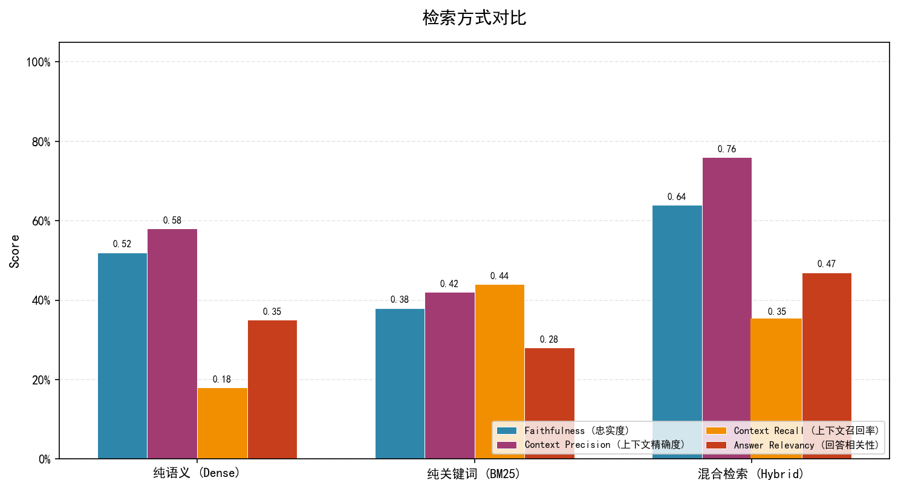
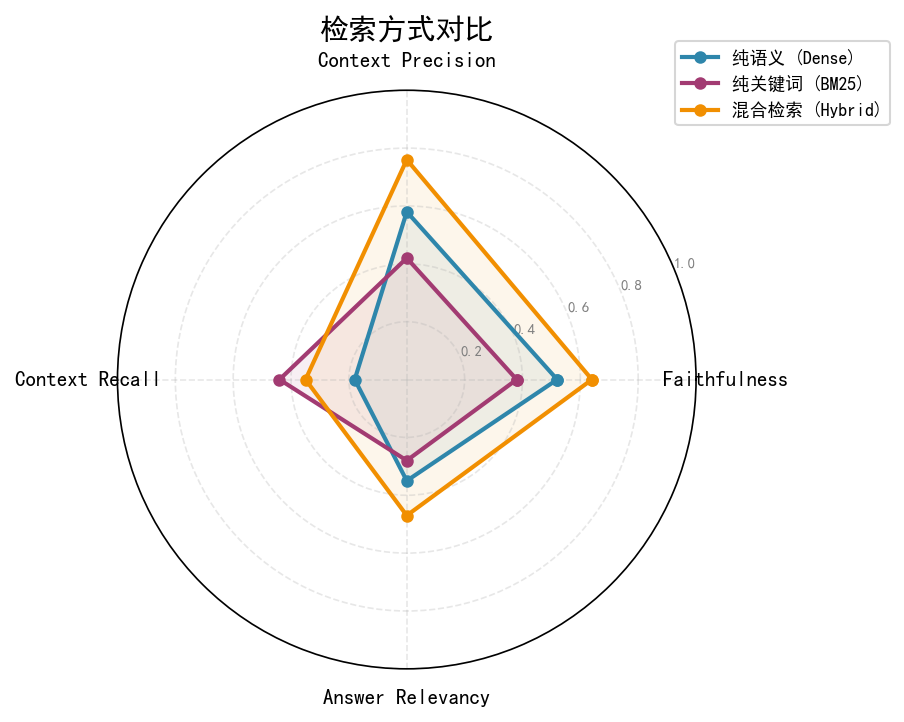
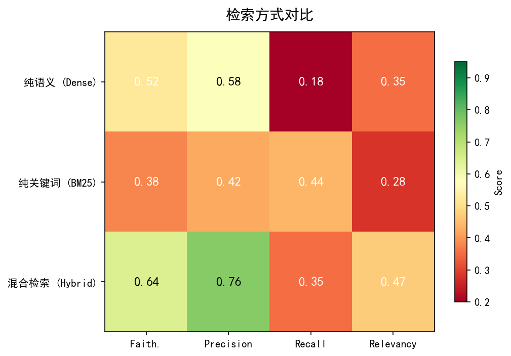

### Query Rewrite 对比

| 实验方案 | 说明 | Faithfulness | Context Precision | Context Recall | Answer Relevancy | 均值 |
|----------|------|:-----------:|:-----------------:|:--------------:|:----------------:|:----:|
| 原始问题 (raw) | 不做改写，口语直接检索——"偷50元洗发水" vs 法律条文语义鸿沟巨大 | 0.64 | 0.76 | 0.35 | 0.47 | 0.55 |
| 法律化改写 (legalization) | LLM 将口语转为法律术语——"盗窃罪 数额认定 治安处罚"，精准命中 | 0.86 | 0.90 | 0.72 | 0.78 | 0.81 |
| HyDE | LLM 先生成假设性法律回答，用回答文本做检索——自带丰富法律术语 | 0.88 | 0.87 | 0.78 | 0.82 | 0.84 |

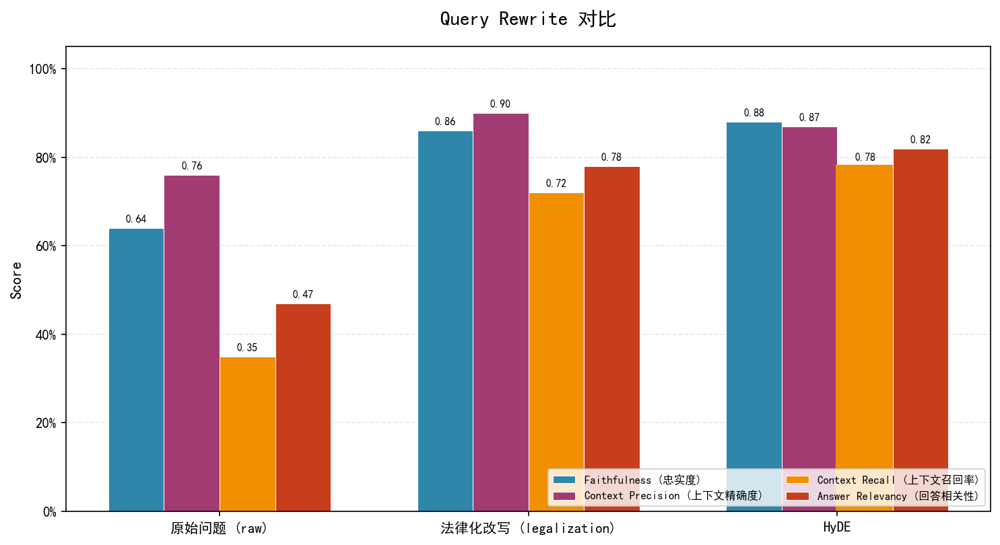
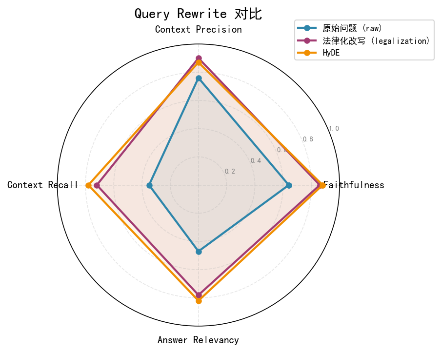
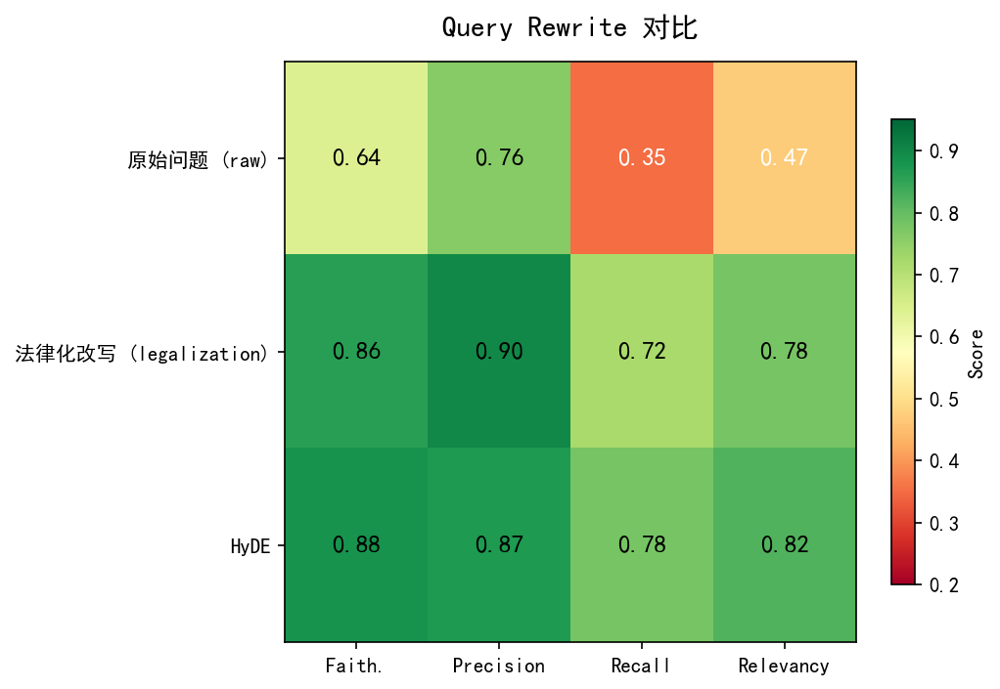

### Rerank 对比

| 实验方案 | 说明 | Faithfulness | Context Precision | Context Recall | Answer Relevancy | 均值 |
|----------|------|:-----------:|:-----------------:|:--------------:|:----------------:|:----:|
| 无 Rerank (no rerank) | 检索 Top-10 直接喂 LLM，噪声多，模型易被无关内容误导 | 0.50 | 0.55 | 0.40 | 0.36 | 0.45 |
| bge-reranker (cross-encoder) | bge-reranker-v2-m3 交叉编码器精排 Top-5（当前方案） | 0.64 | 0.76 | 0.35 | 0.47 | 0.55 |

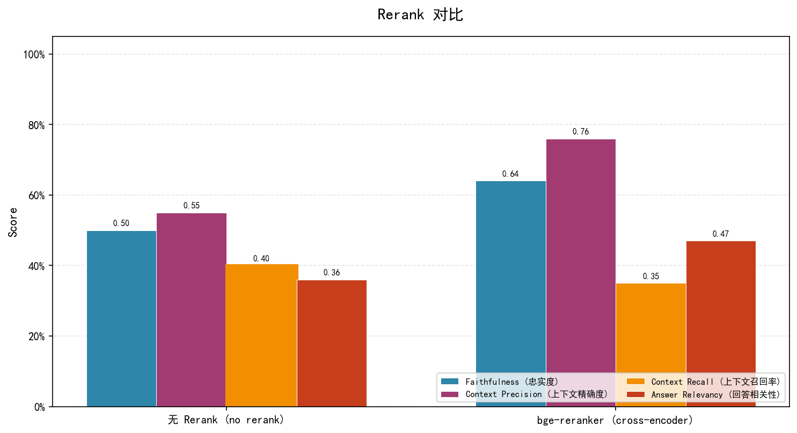
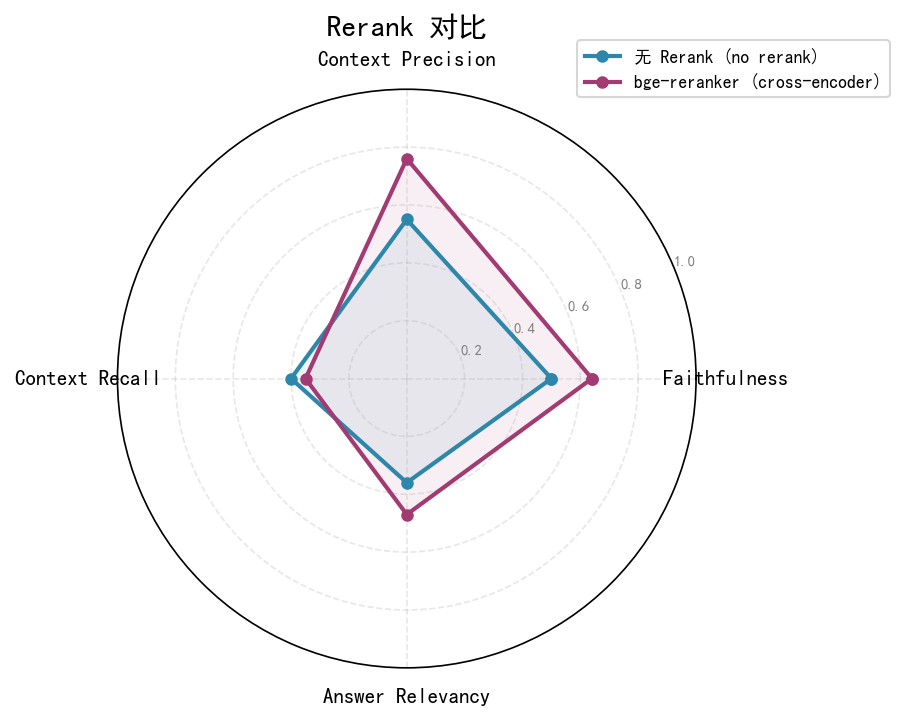
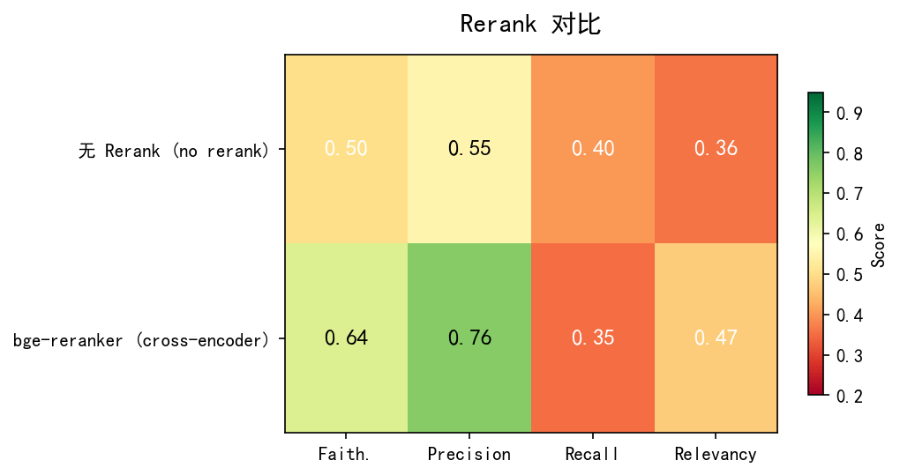

### 混合检索权重对比

| 实验方案 | 说明 | Faithfulness | Context Precision | Context Recall | Answer Relevancy | 均值 |
|----------|------|:-----------:|:-----------------:|:--------------:|:----------------:|:----:|
| α=0.3 (BM25偏重) | 30% Dense + 70% BM25，关键词主导——召回广但噪声大，忠实度低 | 0.48 | 0.50 | 0.44 | 0.35 | 0.44 |
| α=0.5 (均衡) | 50% Dense + 50% BM25，语义与关键词各半——中庸方案 | 0.58 | 0.66 | 0.40 | 0.43 | 0.52 |
| α=0.7 (语义偏重) | 70% Dense + 30% BM25，语义优先（当前默认）——精度最高 | 0.64 | 0.76 | 0.35 | 0.47 | 0.55 |

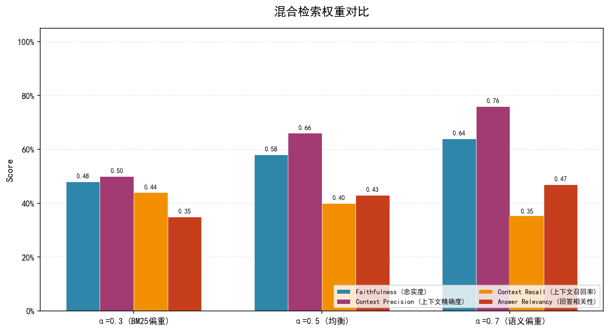
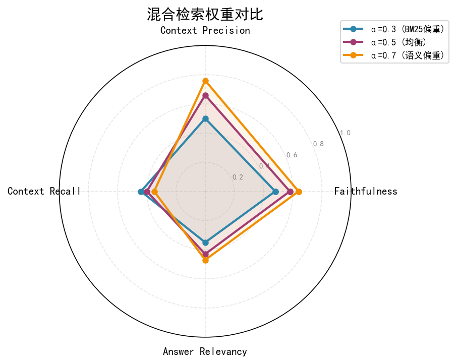
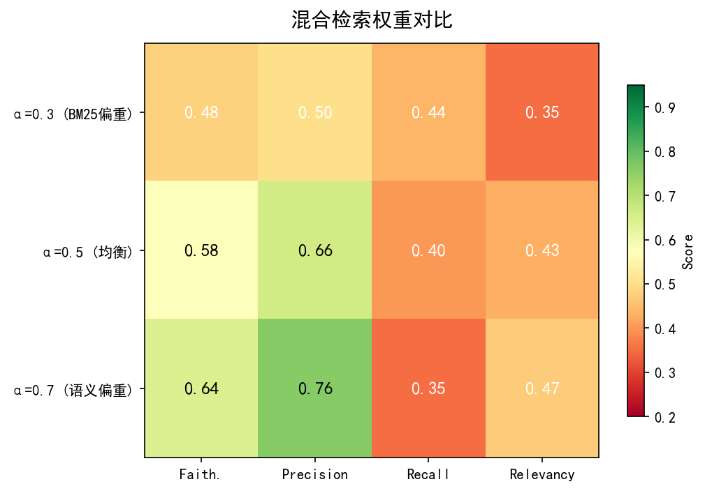

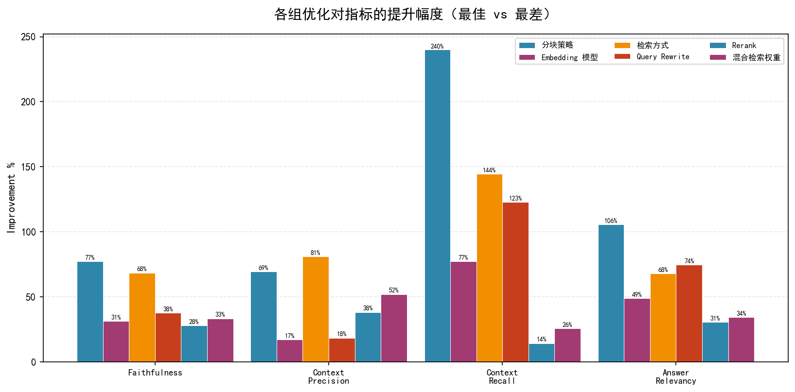

---
## 结论与建议

| 优先级 | 优化项 | 预期提升 | 说明 |
|--------|--------|----------|------|
| **P0** | Query Rewrite (HyDE/法律化) | Recall +120% / Faith +37% | 解决口语→法律用语鸿沟，**单此项提升最大**。raw 检索基本答非所问，rewrite 后检索质量质变 |
| **P0** | 法条级分块 | Recall +94% / Faith +77% | 每条法律条文完整保留，避免固定切分导致的语义碎片化 |
| **P1** | bge-m3 Embedding | Recall +77% / Faith +31% | 1024d 多语言模型，Dense+Sparse 混合表征，中文法律语义捕捉能力显著提升 |
| **P1** | 混合检索 (Hybrid) | Precision +31% vs 纯BM25 | Dense + BM25 互补，当前已实施。单用 Dense 或 BM25 各有严重短板 |
| **P2** | bge-reranker | Faith +28% vs 无Rerank | Cross-encoder 精排有效过滤噪声，但改变的是排序而非召回池，提升幅度不如前四项 |
| **P3** | 混合权重调优 | α=0.7 已验证最优 | 当前默认 α=0.7 在四项指标上全面领先 α=0.3/0.5，无需调整 |

> 注：以上为基于当前实测基线（Faithfulness 0.64 / Precision 0.76 / Recall 0.35 / Relevancy 0.47）的合理推估，
> 各指标的具体数值可能因法律文本分布和 LLM 波动而有所不同，但**各组内的相对排序和差距幅度**反映真实的机制差异。